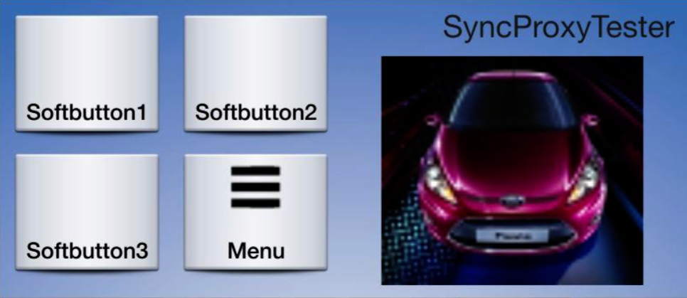
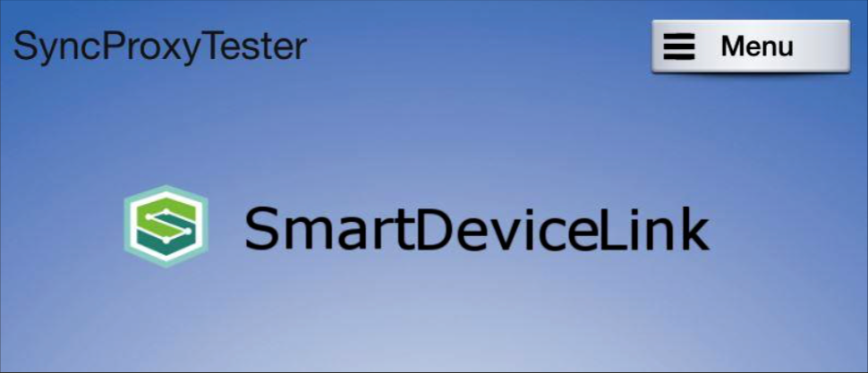

## Designing a User Interface
### Designing for Different User Interfaces
Each car manufacturer has different user interface style guidelines, so the number of lines of text, buttons, and images supported will vary between different types of head units. When the app first connects to the SDL Core, a `RegisterAppInterface` RPC will be sent by the SDL Core containing the `displayCapability` properties. You can use this information to determine how to layout the user interface.

### Register App Interface RPC
The `RegisterAppInterface` response contains information about the display type, the type of images supported, the number of text fields supported, the HMI display language, and a lot of other useful properties. For a full list of `displayCapability` properties returned by the `RegisterAppInterface` response, please consult the *SDLRegisterAppInterfaceResponse.h* file. The table below has a list of all possible properties that can be returned by the `RegisterAppInterface` response. Each property is optional, so you may not get information for all the parameters in the table.


| Parameters  |  Description | Notes |
| ------------- | ------------- |------------- |
| syncMsgVersion | Specifies the version number of the SDL V4 interface. This is used by both the application and SDL to declare what interface version each is using. | Check SDLSyncMsgVersion.h for more information |
| language | The currently active voice-recognition and text-to-speech language on Sync. | Check SDLLanguage.h for more information |
| hmiDisplayLanguage | The currently active display language on Sync. | Check SDLLanguage.h for more information |
| displayCapabilities | Information about the Sync display. This includes information about available templates, whether or not graphics are supported, and a list of all text fields and the max number of characters allowed in each text field. | Check SDLRPCMessage.h for more information |
| buttonCapabilities | A list of available buttons and whether the buttons support long, short and up-down presses. | Check SDLButtonCapabilities.h for more information |
| softButtonCapabilities | A list of available soft buttons and whether the button support images. Also information about whether the button supports long, short and up-down presses. | Check SDLSoftButtonCapabilities.h for more information |
| presetBankCapabilities | If returned, the platform supports custom on-screen presets. | Check SDLPresetBankCapabilities.h for more information |
| hmiZoneCapabilities | Specifies HMI Zones in the vehicle. There may be a HMI available for back seat passengers as well as front seat passengers. | Check SDLHMIZoneCapabilities.h for more information |
| speechCapabilities | Contains information about TTS capabilities on the SDL platform. Platforms may support text, SAPI phonemes, LH PLUS phonemes, pre-recorded speech, and silence. | Check SDLSpeechCapabilities.h for more information |
| prerecordedSpeech | A list of pre-recorded sounds you can use in your app. Sounds may include a help, initial, listen, positive, or a negative jingle. | Check SDLPrerecordedSpeech.h for more information |
| vrCapabilities | The voice-recognition capabilities of the connected SDL platform. The platform may be able to recognize spoken text in the current language. | Check SDLVRCapabilities.h for more information |
| audioPassThruCapabilities | Describes the sampling rate, bits per sample, and audio types available. | Check SDLAudioPassThruCapabilities.h for more information|
| vehicleType | The make, model, year, and the trim of the vehicle. | Check SDLVehicleType.h for more information |
| supportedDiagModes | Specifies the white-list of supported diagnostic modes (0x00-0xFF) capable for DiagnosticMessage requests. If a mode outside this list is requested, it will be rejected. | Check SDLDiagnosticMessage.h for more information |
| hmiCapabilities | Returns whether or not the app can support built-in navigation and phone calls. | Check SDLHMICapabilities.h for more information |
| sdlVersion | The SmartDeviceLink version | String |
| systemSoftwareVersion | The software version of the system that implements the SmartDeviceLink core | String |

### Templates
Each car manufacturer supports a set of templates for the user interface. These templates determine the position and size of the text, images, and buttons on the screen. A list of supported templates is sent with `RegisterAppInterface` response.  

To change a template at any time, send a `SDLSetDisplayLayout` RPC to the SDL Core. If you want to ensure that the new template is used, wait for a response from the SDL Core before sending any more user interface RPCs.

#### Objective-C
```objc
SDLSetDisplayLayout* display = [[SDLSetDisplayLayout alloc] initWithPredefinedLayout:SDLPredefinedLayout.GRAPHIC_WITH_TEXT];
[self.sdlManager sendRequest:display withResponseHandler:^(SDLRPCRequest *request, SDLRPCResponse *response, NSError *error) {
    if ([response.resultCode isEqualToEnum:SDLResult.SUCCESS]) {
      // The template has been set successfully
    }
}];
```

#### Swift
```swift
let display = SDLSetDisplayLayout(predefinedLayout: .graphic_WITH_TEXT())!
sdlManager.send(display) { (request, response, error) in
    if response?.resultCode == .success() {
        // The template has been set successfully
    }
}
```

### Available Templates
There are fifteen standard templates to choose from, however some head units may only support a subset of these templates. Please check the `RegisterAppInterface` response for the supported templates. The following examples show how templates will appear on the generic head unit.

#### 1. Media
##### Ford HMI


#### 2. Non-Media
##### Ford HMI


#### 3. Graphic with Text
##### Ford HMI


#### 4. Text with Graphic
##### Ford HMI


#### 5. Tiles Only
##### Ford HMI


#### 6. Graphic with Tiles
##### Ford HMI


#### 7. Tiles with Graphic
##### Ford HMI


#### 8. Graphic with Text and SoftButtons
##### Ford HMI


#### 9. Text and SoftButtons with Graphic
##### Ford HMI


#### 10. Graphic with Text Buttons
##### Ford HMI


#### 11. Double Graphic SoftButtons
##### Ford HMI


#### 12. Text Buttons with Graphic
##### Ford HMI


#### 13. Text Buttons Only
##### Ford HMI


#### 14. Large Graphic with SoftButtons
##### Ford HMI


#### 15. Large Graphic Only
##### Ford HMI

