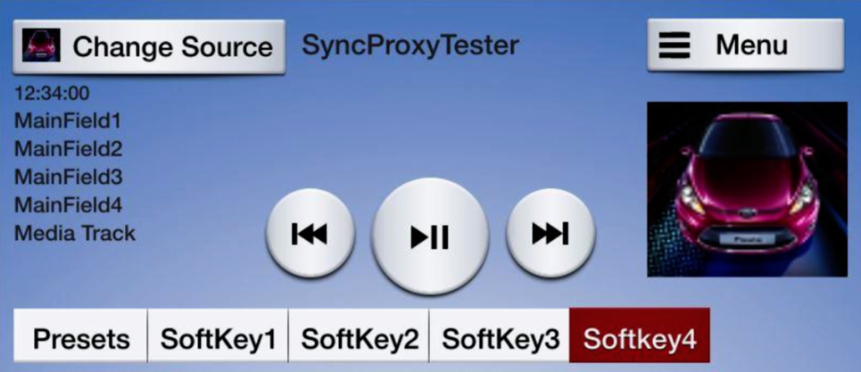
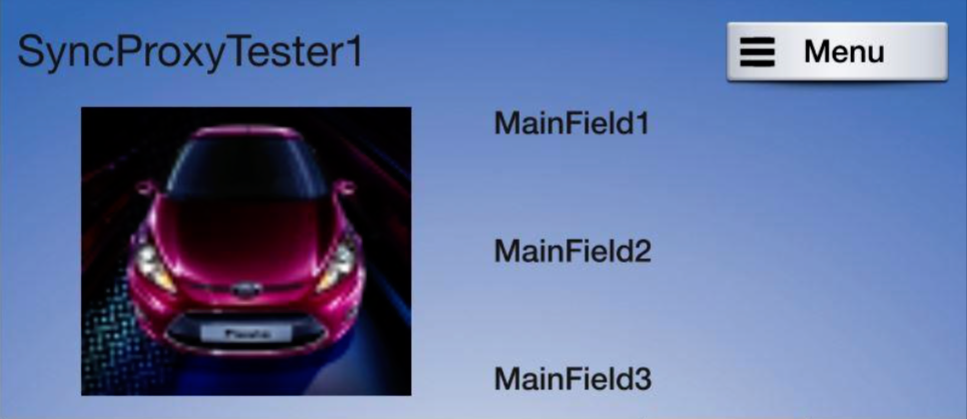
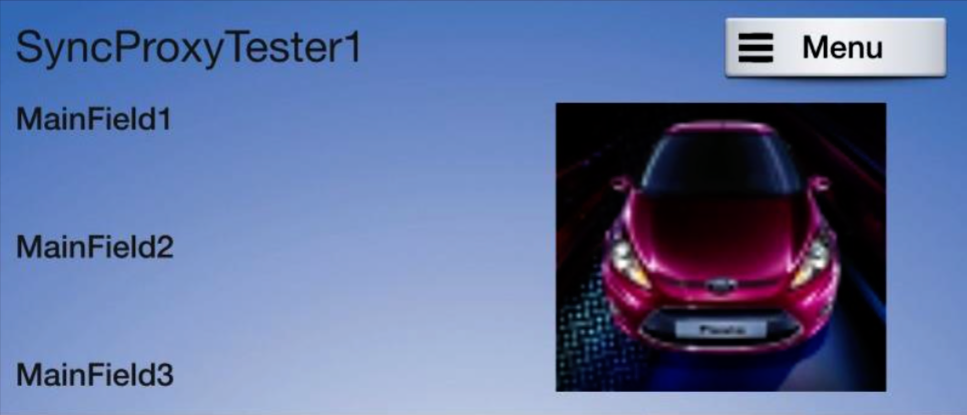
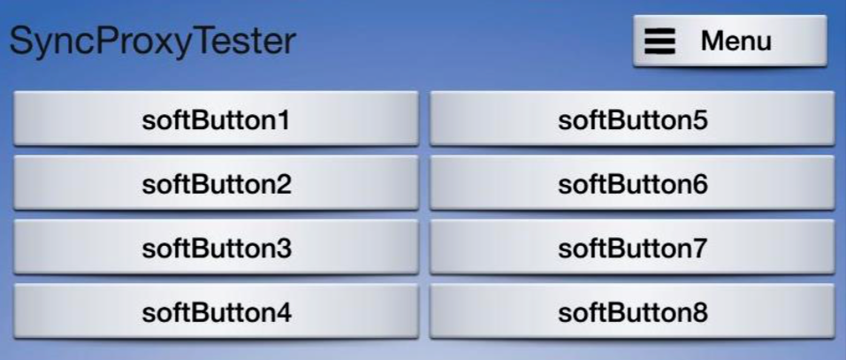

## Designing a User Interface
### Designing for Different User Interfaces
Each car manufacturer has different user interface style guidelines, so the number of lines of text, buttons, and images supported will vary between different types of head units. When the app first connects to the SDL Core, a `RegisterAppInterface` RPC will be sent by the SDL Core containing the `displayCapability` properties. You can use this information to determine how to layout the user interface.

### Register App Interface RPC
The `RegisterAppInterface` response contains information about the display type, the type of images supported, the number of text fields supported, the HMI display language, and a lot of other useful properties. For a full list of `displayCapability` properties returned by the `RegisterAppInterface` response, please consult the *SDLRegisterAppInterfaceResponse.h* file.

| Parameters  |  Description | Notes |
| ------------- | ------------- |------------- |
| syncMsgVersion | Specifies the version number of the SDL V4 interface. This is used by both the application and SDL to declare what interface version each is using | Check SDLSyncMsgVersion.h for more information |
| language | The currently active voice-recognition and text-to-speech language on Sync | Check SDLLanguage.h for more information |
| hmiDisplayLanguage | The currently active display language on Sync | Check SDLLanguage.h for more information |
| displayCapabilities | Information about the SDL Core display. This includes information about available templates, whether or not graphics are supported, and a list of all text fields and the max number of characters allowed in each field | Check SDLRPCMessage.h for more information |
| buttonCapabilities | A list of available buttons and whether the buttons support long, short and up-down presses | Check SDLButtonCapabilities.h for more information |
| softButtonCapabilities | A list of available buttons and whether the button support images. Also information about whether the button supports long, short and up-down presses  | Check SDLSoftButtonCapabilities.h for more information |
| presetBankCapabilities | If returned, the platform supports custom on-screen Presets | Check SDLPresetBankCapabilities.h for more information |
| hmiZoneCapabilities | TODO | Check SDLHMIZoneCapabilities.h for more information |
| speechCapabilities | TODO | Check SDLSpeechCapabilities.h for more information |
| prerecordedSpeech | TODO | Check SDLPrerecordedSpeech.h for more information |
| vrCapabilities | TODO | Check SDLVRCapabilities.h for more information |
| audioPassThruCapabilities | Describes the sampling rate, bits per sample, and audio types available | Check SDLAudioPassThruCapabilities.h for more information|
| vehicleType | The make, model, year, and the trim of the vehicle | Check SDLVehicleType.h for more information |
| supportedDiagModes | Specifies the white-list of supported diagnostic modes (0x00-0xFF) capable for DiagnosticMessage requests. If a mode outside this list is requested, it will be rejected |   |
| hmiCapabilities | Whether or not the app can support built-in navigation and phone calls | Check SDLHMICapabilities.h for more information |
| sdlVersion | The SmartDeviceLink version |  |
| systemSoftwareVersion | The software version of the system that implements the SmartDeviceLink core | a |

### Templates
Each car manufacturer supports a set of templates for the user interface. These templates determine the position and size of the text, images, and buttons on the screen. A list of supported templates is sent with `RegisterAppInterface` response.  

To change a template at any time, send a `SDLSetDisplayLayout` RPC to the SDL Core. If you want to ensure that the new template is used, wait for a response from the SDL Core before sending any more user interface RPCs.
```swift
let layout = SDLPredefinedLayout.GRAPHIC_WITH_TEXT() // Set template type here
let display = SDLSetDisplayLayout()
display.displayLayout = display.value
sdlManager?.sendRequest(display, withResponseHandler: { (request, response, error) in
    if response?.resultCode == SDLResult.SUCCESS() {
      // The template has been set successfully
    }
})
```
#### Available Templates
There are fifteen standard templates to choose from but each head unit may only support a subset of those templates. Please check the `RegisterAppInterface` response for the supported templates. The following examples show how templates will appear on the generic head unit.

##### 1. MEDIA - with and without progress bar



##### 2. NON-MEDIA - with and without soft buttons


##### 3. GRAPHIC_WITH_TEXT

##### 4. TEXT_WITH_GRAPHIC

##### 5. TILES_ONLY

##### 6. GRAPHIC_WITH_TILES

##### 7. TILES_WITH_GRAPHIC

##### 8. GRAPHIC_WITH_TEXT_AND_SOFTBUTTONS

##### 9. TEXT_AND_SOFTBUTTONS_WITH_GRAPHIC

##### 10. GRAPHIC_WITH_TEXTBUTTONS

##### 11. DOUBLE_GRAPHIC_SOFTBUTTONS

##### 12. TEXTBUTTONS_WITH_GRAPHIC

##### 13. TEXTBUTTONS_ONLY

##### 14. LARGE_GRAPHIC_WITH_SOFTBUTTONS

##### 15. LARGE_GRAPHIC_ONLY

