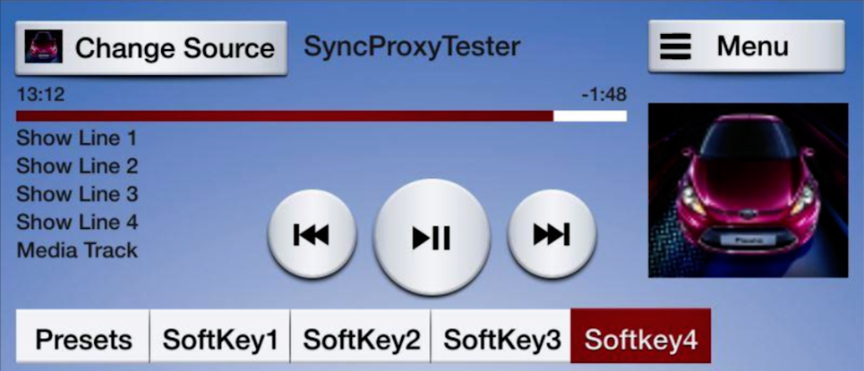
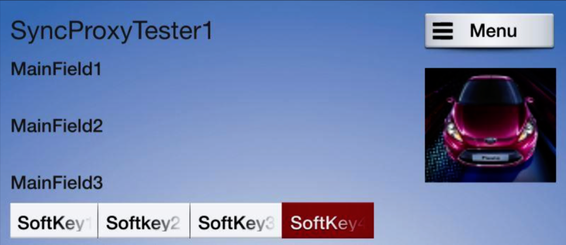
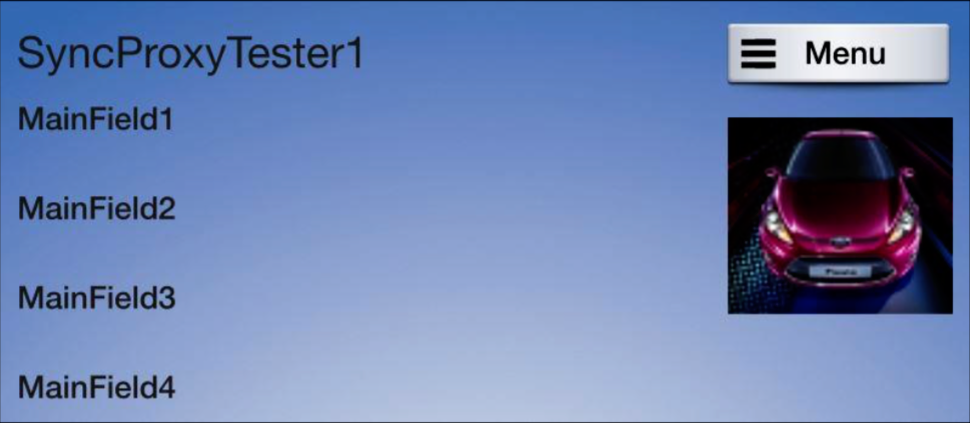
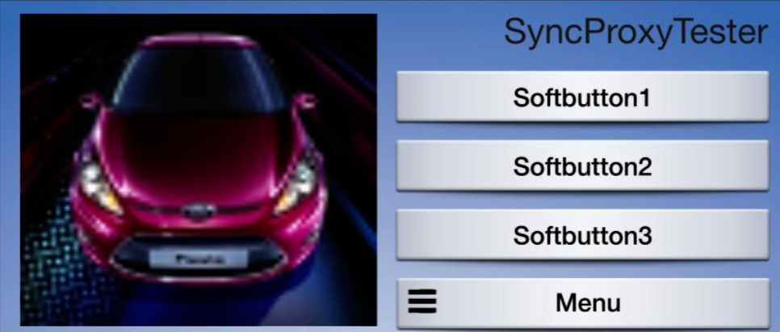

## Designing a User Interface
### Designing for Different User Interfaces
Each car manufacturer has different user interface style guidelines, so the number of lines of text, buttons, and images supported will vary between different type of head units. When the app first connects to the SDL Core, a `RegisterAppInterface` RPC will be sent by the SDL Core containing the `displayCapability` properties. You can use this information to determine how to layout the user interface.

The `RegisterAppInterface` response contains information about the display type, the type of images supported, the number of text fields supported, the HMI display language, and a lot of other useful properties. For a full list of `displayCapability` properties returned by the `RegisterAppInterface` response, please consult the *SDLRegisterAppInterfaceResponse.h* file.

### Templates
Each car manufacturer supports a set of templates for the user interface. These templates determine the position and size of the text, images, and buttons on the screen. A list of supported templates is sent with RegisterAppInterface response.  

To change a template at any time, send a `SDLSetDisplayLayout` RPC to the SDL Core. If you want to ensure that the new template is used, wait for a response from the SDL Core before sending any more user interface RPCs.
```swift
let layout = SDLPredefinedLayout.GRAPHIC_WITH_TEXT() // Set template type here
let display = SDLSetDisplayLayout()
display.displayLayout = display.value
sdlManager?.sendRequest(display, withResponseHandler: { (request, response, error) in
    if response?.resultCode == SDLResult.SUCCESS() {
      // The template has been set successfully
    }
})
```
#### Available Templates
The following examples show how templates will appear on the generic head unit
##### 1. MEDIA - with and without progress bar



##### 2. NON-MEDIA - with and without soft buttons



##### 3. GRAPHIC_WITH_TEXT

##### 4. TEXT_WITH_GRAPHIC

##### 5. TILES_ONLY

##### 6. GRAPHIC_WITH_TILES

##### 7. TILES_WITH_GRAPHIC

##### 8. GRAPHIC_WITH_TEXT_AND_SOFTBUTTONS

##### 9. TEXT_AND_SOFTBUTTONS_WITH_GRAPHIC

##### 10. GRAPHIC_WITH_TEXTBUTTONS

##### 11. DOUBLE_GRAPHIC_SOFTBUTTONS

##### 12. TEXTBUTTONS_WITH_GRAPHIC

##### 13. TEXTBUTTONS_ONLY

##### 14. LARGE_GRAPHIC_WITH_SOFTBUTTONS

##### 15. LARGE_GRAPHIC_ONLY


### Text, Buttons, and Images
All text,  images, and buttons on the HMI screen must be sent as part of a `SDLShow` RPC. Subscribe buttons are sent as part of a `SDLSubscribeButton` RPC.

#### Text
A maximum of four lines of text can be set in `SDLShow` RPC, however, some templates may only support 1, 2, or 3 lines of text. If all four lines of text are set in the `SDLShow` RPC, but the template only supports three lines of text, then the fourth line will simply be ignored.
```swift
let show: SDLShow = SDLShow()
show.mainField1 = "line 1 of text"
show.mainField2 = "line 2 of text"
show.mainField3 = "line 3 of text"
show.mainField4 = "line 4 of text"
sdlManager?.sendRequest(show, withResponseHandler: { (request, response, error) in
    if response?.resultCode == SDLResult.SUCCESS() {
        // The text has been set successfully
    }
})
```

#### Images
The position and size of images on the screen is determined by the currently set template. All images must first be uploaded the SDL Core using the `SDLManager`’s file manager before being used in a `SDLShow` RPC. Once the image has been successfully uploaded, the app will be notified by the SDL Core.

!!! NOTE
Some head units you may be connected to may not support images at all. Please consult the `graphicsSupported` property of the display capabilities in the `RegisterAppInterface` response.
!!!

##### 1. Image File Type
Images can be formatted as PNG, JPEG, or BMP. Check the `displayCapability` properties to find out what image formats the head unit supports.

##### 2. Upload an Image
Use the SDLArtwork class to easily upload images to the head unit. The image name is a unique id for image.

!!! NOTE
The image name can only consist of letters and numbers, otherwise the image may not be uploaded.
!!!

```swift
// SDLArtwork
let imageName: String = "unique name for image"
let image: UIImage = UIImage(named: imageName)
let artwork: SDLArtwork = SDLArtwork(image: image, name: imageName, as: SDLArtworkImageFormat.JPG)

// Upload the image data to the head unit
sdlManager?.fileManager.uploadFile(artwork, completionHandler: { (successful, length, error) in
    if successful {
        // Image has been uploaded
    }
    else {
        // Image was not uploaded
    }
})
```

##### 3. Storing Images
An image can be stored forever (persistent) on the head unit, or for only as long as the app is running (ephemeral). Set the `persistent` parameter in `SDLArtwork` to false if the image should only be stored as long as the app is open. Set it to true if the image should stay on the head unit forever. Remember that your app has a finite amount of storage, so it may be best to use ephemeral images in image intensive apps. To delete a persistent image, you will either need to manually delete the image or do a factory reset on the head unit.

```swift
// SDLArtwork
let imageName: String = "unique name for image"
let image: UIImage = UIImage(named: imageName)
let artwork: SDLArtwork = SDLArtwork(image: image, name: imageName, persistent: false, as: SDLArtworkImageFormat.JPG)
```

###### Check the Amount of File Storage
To find the amount of file storage left on the head unit, use the `SDLManager`’s file manager, `bytesAvailable` method.
```swift
let bytesAvailable = sdlManager?.fileManager.bytesAvailable
```

##### 4. Check if an Image Has Already Been Uploaded
Use the file manager to check if an image name has already been used to upload an image  to the head unit.
```swift
let fileIsOnHeadUnit: Bool = sdlManager?.fileManager.remoteFileNames.contains(“name for image”)
```

##### 5. Overwrite Stored Images
If an image being uploaded has the same name as an already uploaded image, the new image will be ignored. To override this setting, set the `SDLArtwork`’s `overwrite` property to true.
```swift
// SDLArtwork
let imageName: String = "unique name for image"
let image: UIImage = UIImage(named: imageName)
let artwork: SDLArtwork = SDLArtwork(image: image, name: imageName, persistent: false, as: SDLArtworkImageFormat.JPG)
artwork.overwrite = true
```

##### 6. Delete Stored Images
Use the file manager’s delete request to delete an image associated with an image name.
```swift
sdlManager.fileManager.deleteRemoteFileWithName("name for image", completionHandler: { (successful, length, error) in
    if successful {
        // Image was deleted successfully
    }
})
```

##### 7. Show the Image on a Head Unit
Once the image has been uploaded to the head unit, you can show the image on the user interface. To send the image, create a `SDLImage`, and send it using the `SDLShow` RPC. The `value` property should be set to the same value used in the `name` property of the uploaded `SDLArtwork`. Since you are uploading your own image, the `imageType` property should be set to `dynamic`.

```swift
// SDLImage
let sdlImage: SDLImage = SDLImage()
sdlImage.imageType = SDLImageType.dynamic()
sdlImage.value = artwork.name

let show: SDLShow = SDLShow()
show.graphic = sdlImage
self.sdlManager?.send(show)
```

##### 8. Upload Image Example
```swift
func uploadAnImageExample() {
    // SDLArtwork
    let imageName: String = "unique name for image"
    let image: UIImage = UIImage(named: imageName) ?? UIImage()
    let artwork: SDLArtwork = SDLArtwork(image: image, name: imageName, persistent: false, as: SDLArtworkImageFormat.JPG)
    artwork.overwrite = false

    uploadImage(artwork: artwork) { (sdlImage) in
        if let sdlImage = sdlImage {
            // Image was uploaded successfully
            // You can now show the image on the head unit
            let show: SDLShow = SDLShow()
            show.graphic = sdlImage
            self.sdlManager?.send(show)
        }
    }
}

typealias ImageUploadedCompletionHandler = (_ sdlImage: SDLImage?) -> Void
func uploadImage(artwork: SDLArtwork, completionHandler: @escaping ImageUploadedCompletionHandler) {

    // SDLImage
    let sdlImage: SDLImage = SDLImage()
    sdlImage.imageType = SDLImageType.dynamic()
    sdlImage.value = artwork.name

    // Check if the image has already been uploaded to the head unit
    let fileIsOnHeadUnit = sdlManager?.fileManager.remoteFileNames.contains(artwork.name)
    if fileIsOnHeadUnit == true {
        // The image has already been uploaded to the head unit, simply return the image data
        completionHandler(sdlImage)
    }
    else {
        // Upload the image data to the head unit
        sdlManager?.fileManager.uploadFile(artwork, completionHandler: { (successful, length, error) in
            if successful {
                completionHandler(sdlImage)
            }
            else {
                completionHandler(nil)
            }
        })
    }
}
```

#### Soft & Subscribe Buttons
Buttons on the HMI screen are referred to as soft buttons to distinguish them from hard buttons, which are physical buttons on the head unit. Don’t confuse soft buttons with subscribe buttons, which are buttons that can detect user selection on hard buttons (or built-in soft buttons).
##### Soft Buttons
Soft buttons can be created with text, images or both text and images. The location, size, and number of soft buttons visible on the screen depends on the template. If the button has an image, remember to upload the image first to the head unit before setting the image in the `SDLSoftButton` instance.

!!! NOTE
If a button type is set to `image` or `both` but no image is stored on the head unit, the button might not show up on the HMI screen.
!!!

```swift
let show = SDLShow()
let softButton = SDLSoftButton()

// Button handler - This is called when user presses the button
softButton.handler = { (notification) in
    if let notification: SDLOnButtonEvent = notification as? SDLOnButtonEvent {
        if notification.buttonEventMode == SDLButtonEventMode.BUTTONDOWN() {
            // The user has pressed down on the button
        }
        if notification.buttonEventMode == SDLButtonEventMode.BUTTONUP() {
            // The user has release the button
        }
    }
}

// Button type can be text, image, or both text and image
softButton.type = SDLSoftButtonType.BOTH()

// Button text
softButton.text = "title for button"

// Button image
let image: SDLImage = SDLImage()
image.imageType = SDLImageType.DYNAMIC()
image.value = "button identifier that was sent with SDLPutfile"
softButton.image = image

// The buttons are set as part of an array
show.softButtons = [softButton]

// Send the request
self.sdlManager?.sendRequest(show, withResponseHandler: { (request, response, error) in
    if response?.resultCode == SDLResult.SUCCESS() {
        // The button was created successfully
    }
})
```
##### Subscribe Buttons
Subscribe buttons are used to detect changes to hard buttons. You can subscribe to the following hard buttons:

| Button  | Template | Button Type |
| ------------- | ------------- | ------------- |
| Ok (play/pause) | media template only | soft button and hard button |
| Seek left | media template only | soft button and hard button |
| Seek right | media template only | soft button and hard button |
| Tune up | media template only | hard button |
| Tune down | media template only | hard button |
| Preset 0-9 | any template | hard button |
| Search | any template |hard button |
| Custom | any template | hard button |

Audio buttons like the OK (i.e. the `play/pause` button), seek left, seek right, tune up, and tune down buttons can only be used with a media template. The OK, seek left, and seek right buttons will also show up on the screen in a predefined location dictated by the media template on touchscreens. The app will be notified when the user selects the subscribe button on the screen or when the user manipulates the corresponding hard button.

!!! NOTE
You will automatically be assigned the media template if you set your configuration app type as `MEDIA`.
!!!

### Default Menu
Every template has a default menu button. The position of this button varies between templates, and can not be removed from the template. Items can be added to the menu button at the root level or to a submenu. It is important to note that a submenu can only be one level deep.

#### Add Menu Items
The `SDLAddCommand` RPC can be used to add items to the root menu or to a submenu. Each `SDLAddCommand` RPC must be sent with a unique id, a voice-recognition command, and a set of menu parameters. The menu parameters include the menu name, the position of the item in the menu, and the id of the menu item’s parent. If the menu item is being added to the root menu, then the parent id is 0. If it is being added to a submenu, then the parent id is the submenu’s id.

```swift
let menuItem = SDLAddCommand()

// Create the menu parameters
let menuParameters = SDLMenuParams()
menuParameters.menuName = "menu item name"
menuParameters.position = 0
// The parent id is 0 if adding to the root menu
// If adding to a submenu, the parent id is the submenu's id
menuParameters.parentID = 0

// Set the menu parameters
menuItem.menuParams = menuParameters

// Called when menu item is selected
menuItem.handler = { (notification) in
    if let notification: SDLOnCommand = notification as? SDLOnCommand {
        if notification.triggerSource == SDLTriggerSource.MENU() {
            // Menu item was selected
        }
    }
}

// Voice recognition commands
menuItem.vrCommands = ["voice recognition command"]
menuItem.cmdID = 1234   // Give it a unique id
sdlManager?.sendRequest(menuItem)
```

#### Add a Submenu
To create a submenu, first send a `SDLAddSubMenu` RPC. When a response is received from the SDL Core, check if the submenu was added successfully. If it was, send an `SDLAddCommand` RPC for each item in the submenu.
```swift
let submenu = SDLAddSubMenu()
submenu.menuName = menuName
submenu.menuID = 5678
sdlManager?.sendRequest(submenu, withResponseHandler: { (request, response, error) in
    if response?.resultCode == SDLResult.SUCCESS() {
        // The submenu was created successfully, start adding the submenu items
    }
})
```

#### Delete Menu Items
Use the cmdID of the menu item to tell the SDL Core which item to delete using the `SDLDeleteCommand` RPC.
```swift
let deleteMenuItem = SDLDeleteCommand()
deleteMenuItem.cmdID = 1234
sdlManager?.sendRequest(deleteMenuItem, withResponseHandler: { (request, response, error) in
    if response?.resultCode == SDLResult.SUCCESS() {
        // The menu item was successfully deleted
    }
})
```

#### Delete Submenus
Use the menuID to tell the SDLCore which item to delete using the `SDLDeleteSubMenu` RPC.
```swift
let deleteSubmenu = SDLDeleteSubMenu()
deleteSubmenu.menuID = 5678
sdlManager?.sendRequest(deleteSubmenu, withResponseHandler: { (request, response, error) in
    if response?.resultCode == SDLResult.SUCCESS() {
        // The sub menu was successfully deleted
    }
})
```

### Custom Menu
Custom menus are created by sending two different RPCs. First a `SDLCreateInteractionChoiceSet` RPC must be sent. This RPC sends a list of items that will show up in the menu. When the request has been registered successfully, then a `SDLPerformInteraction` RPC is sent. The `SDLPerformInteraction` RPC sends the formatting requirements, the voice-recognition commands, and a timeout command.

#### Create a Set of Custom Menu Items
Each menu item choice defined in `SDLChoice` should be assigned a unique id. The choice set in `SDLCreateInteractionChoiceSet` should also have its own unique id.
```swift
let request = SDLCreateInteractionChoiceSet()
var choiceSet: [SDLChoice] = []

let choice = SDLChoice()
choice.choiceID = 9876
choice.menuName = "menu title"
choice.vrCommands = ["menu commands"]

choiceSet.append(choice)
request.choiceSet = NSMutableArray(array: choiceSet)
request.interactionChoiceSetID = 1111
sdlManager?.sendRequest(createRequest, withResponseHandler: { (request, response, error) in
  if response?.resultCode == SDLResult.SUCCESS() {
  		// The request was successful, now send the SDLPerformInteraction RPC
  }
})
```

#### Format the Set of Custom Menu Items
Once the set of menu items has been sent to SDL Core, send a `SDLPerformInteraction` RPC to get the items to show up on the HMI screen.
```swift
let request = SDLPerformInteraction()
request.initialText = "text displayed when menu starts"
request.interactionChoiceSetIDList = NSMutableArray(array: [1111])
```

##### Interaction Mode
The interaction mode specifies the way the user is prompted to make a section and the way in which the user’s selection is recorded.

| Interaction Mode  | Description |
| ------------- | ------------- |
| Manual only | Interactions occur only through the display |
| VR only | Interactions occur only through text-to-speech and voice recognition |
| Both | Interactions can occur both manually or through VR |
```swift
request.interactionMode = SDLInteractionMode.MANUAL_ONLY()
```

##### Interaction Layout
The list can be shown as a grid of buttons with images  or as a vertical list of choices.

| Layout Mode  | Formatting Description |
| ------------- | ------------- |
| Icon only | A grid of buttons with images |
| Icon with search | A grid of buttons with images along with a search field in the HMI |
| List only | A vertical list  of text |
| List with search | A vertical list of text with a search field in the HMI |
| Keyboard | A keyboard shows up immediately in the HMI |
```swift
request.interactionLayout = SDLLayoutMode.LIST_ONLY()
```

##### Text-to-Speech (TTS)
A text-to-speech chunk is a text phrase or prerecorded sound that the SDL will speak. The text parameter specifies the text to be spoken, or the name of the pre-recorded sound. Use the type parameter to define the type of information in the text parameter. The `SDLPerformInteraction` request can have a initial, timeout, and a help prompt.
```swift
let prompt = SDLTTSChunk()
prompt.text = "Helpful text"
prompt.type = SDLSpeechCapabilities.TEXT()
request.initialPrompt = NSMutableArray(array: [prompt])
```

##### Timeout
The timeout parameter defines the amount of time the menu will appear on the screen before the menu is dismissed automatically by the HMI.
```swift
request.timeout = 30000 // 30 seconds
```

##### Send the Request
```swift
sdlManager?.sendRequest(request, withResponseHandler: { (request, response, error) in

    // Wait for user's selection or for timeout
    if response?.resultCode == SDLResult.SUCCESS() {
        if let response: SDLPerformInteractionResponse = response as? SDLPerformInteractionResponse {
            let choiceId = response.choiceID
            // The user selected an item in the custom menu                     
        }
    }

    else if response?.resultCode == SDLResult.TIMED_OUT() {
        // The custom menu timed out before the user could select an item
    }
})
```

#### Delete the Custom Menu
If the information in the menu is dynamic, then the old interaction choice set needs to be deleted with a `SDLDeleteInteractionChoiceSet` RPC before the new information can be added to the menu. Use the interaction choice set id to delete the menu.
```swift
let deleteRequest = SDLDeleteInteractionChoiceSet()
deleteRequest.interactionChoiceSetID = 1111
sdlManager?.sendRequest(deleteRequest, withResponseHandler: { (request, response, error) in
    if response?.resultCode == SDLResult.SUCCESS() {
     	// The custom menu was deleted successfully
    }
})
```
