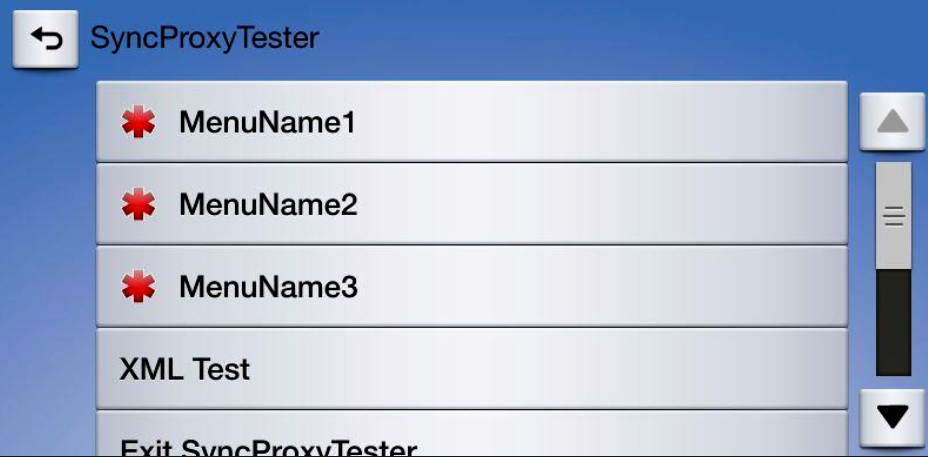
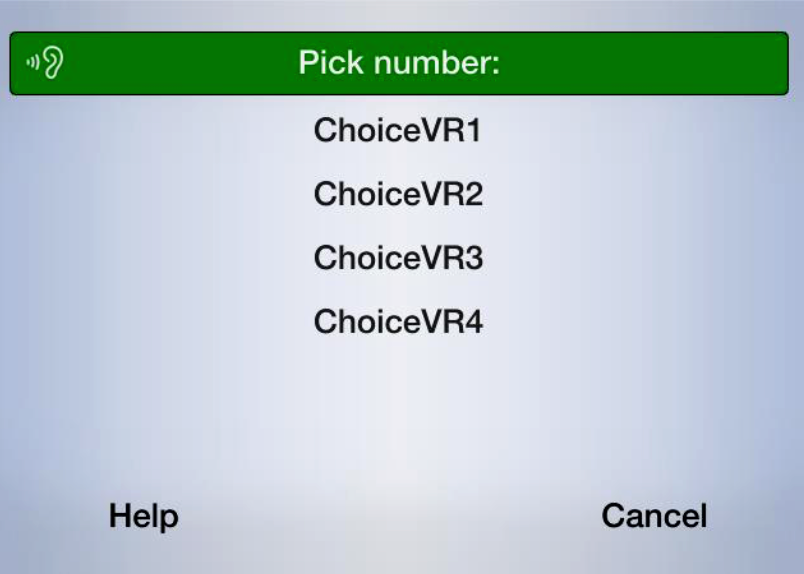

## Menus
You have two different options when creating menus. One is to simply add items to the default menu available in every template. The other is to create a custom menu that pops up when needed.

### Default Menu
  
Every template has a default menu button. The position of this button varies between templates, and can not be removed from the template. The default menu is initially empty except for an "Exit Your App Name" button. Items can be added to the menu at the root level or to a submenu. It is important to note that a submenu can only be one level deep.

#### Menu Structure


#### Add Menu Items
The `SDLAddCommand` RPC can be used to add items to the root menu or to a submenu. Each `SDLAddCommand` RPC must be sent with a unique id, a voice-recognition command, and a set of menu parameters. The menu parameters include the menu name, the position of the item in the menu, and the id of the menu item’s parent. If the menu item is being added to the root menu, then the parent id is 0. If it is being added to a submenu, then the parent id is the submenu’s id.

```swift
let menuItem = SDLAddCommand()

// Create the menu parameters
let menuParameters = SDLMenuParams()
menuParameters.menuName = "menu item name"
menuParameters.position = 0
// The parent id is 0 if adding to the root menu
// If adding to a submenu, the parent id is the submenu's id
menuParameters.parentID = 0

// Set the menu parameters
menuItem.menuParams = menuParameters

// Called when menu item is selected
menuItem.handler = { (notification) in
    if let notification: SDLOnCommand = notification as? SDLOnCommand {
        if notification.triggerSource == SDLTriggerSource.MENU() {
            // Menu item was selected
        }
    }
}

// Voice recognition commands
menuItem.vrCommands = ["voice recognition command"]
menuItem.cmdID = 1234   // Give it a unique id
sdlManager?.sendRequest(menuItem)
```

#### Add a Submenu
To create a submenu, first send a `SDLAddSubMenu` RPC. When a response is received from the SDL Core, check if the submenu was added successfully. If it was, send an `SDLAddCommand` RPC for each item in the submenu.
```swift
let submenu = SDLAddSubMenu()
submenu.menuName = menuName
submenu.menuID = 5678
sdlManager?.sendRequest(submenu, withResponseHandler: { (request, response, error) in
    if response?.resultCode == SDLResult.SUCCESS() {
        // The submenu was created successfully, start adding the submenu items
    }
})
```

#### Delete Menu Items
Use the cmdID of the menu item to tell the SDL Core which item to delete using the `SDLDeleteCommand` RPC.
```swift
let deleteMenuItem = SDLDeleteCommand()
deleteMenuItem.cmdID = 1234
sdlManager?.sendRequest(deleteMenuItem, withResponseHandler: { (request, response, error) in
    if response?.resultCode == SDLResult.SUCCESS() {
        // The menu item was successfully deleted
    }
})
```

#### Delete Submenus
Use the menuID to tell the SDLCore which item to delete using the `SDLDeleteSubMenu` RPC.
```swift
let deleteSubmenu = SDLDeleteSubMenu()
deleteSubmenu.menuID = 5678
sdlManager?.sendRequest(deleteSubmenu, withResponseHandler: { (request, response, error) in
    if response?.resultCode == SDLResult.SUCCESS() {
        // The sub menu was successfully deleted
    }
})
```  

### Custom Menus
Custom menus, called **perform interactions**, are one level deep, however, you can create submenus by triggering another perform interaction when the user selects a row in a menu. Perform interactions can be set up to recognize speech, so a user can select an item in the menu by speaking their preference rather than physically selecting the item.

 Perform interactions are created by sending two different RPCs. First a `SDLCreateInteractionChoiceSet` RPC must be sent. This RPC sends a list of items that will show up in the menu. When the request has been registered successfully, then a `SDLPerformInteraction` RPC is sent. The `SDLPerformInteraction` RPC sends the formatting requirements, the voice-recognition commands, and a timeout command.

#### Create a Set of Custom Menu Items
Each menu item choice defined in `SDLChoice` should be assigned a unique id. The choice set in `SDLCreateInteractionChoiceSet` should also have its own unique id.
```swift
let request = SDLCreateInteractionChoiceSet()
var choiceSet: [SDLChoice] = []

let choice = SDLChoice()
choice.choiceID = 9876
choice.menuName = "menu title"
choice.vrCommands = ["menu commands"]

choiceSet.append(choice)
request.choiceSet = NSMutableArray(array: choiceSet)
request.interactionChoiceSetID = 1111
sdlManager?.sendRequest(createRequest, withResponseHandler: { (request, response, error) in
  if response?.resultCode == SDLResult.SUCCESS() {
  		// The request was successful, now send the SDLPerformInteraction RPC
  }
})
```

#### Format the Set of Custom Menu Items
Once the set of menu items has been sent to SDL Core, send a `SDLPerformInteraction` RPC to get the items to show up on the HMI screen.
```swift
let request = SDLPerformInteraction()
request.initialText = "text displayed when menu starts"
request.interactionChoiceSetIDList = NSMutableArray(array: [1111])
```

##### Interaction Mode
The interaction mode specifies the way the user is prompted to make a section and the way in which the user’s selection is recorded.

| Interaction Mode  | Description |
| ------------- | ------------- |
| Manual only | Interactions occur only through the display |
| VR only | Interactions occur only through text-to-speech and voice recognition |
| Both | Interactions can occur both manually or through VR |
```swift
request.interactionMode = SDLInteractionMode.MANUAL_ONLY()
```
###### VR Only Interaction Mode


###### Manual Only Interaction Mode


###### Both VR and Manual Interaction Modes
When the interaction mode is set to `Both`, the VR menu will appear first. When the user touches the screen, the VR menu will be dismissed, and they can select an item from the manual menu.

##### Interaction Layout
The items in the perform interaction can be shown as a grid of buttons (with optional images) or as a list of choices.

| Layout Mode  | Formatting Description |
| ------------- | ------------- |
| Icon only | A grid of buttons with images |
| Icon with search | A grid of buttons with images along with a search field in the HMI |
| List only | A vertical list  of text |
| List with search | A vertical list of text with a search field in the HMI |
| Keyboard | A keyboard shows up immediately in the HMI |
```swift
request.interactionLayout = SDLLayoutMode.LIST_ONLY()
```

###### Icon Only Interaction Layout


###### List Only Interaction Layout


###### List with Search Interaction Layout


##### Text-to-Speech (TTS)
A text-to-speech chunk is a text phrase or prerecorded sound that will be spoken by the head unit. The text parameter specifies the text to be spoken or the name of the pre-recorded sound. Use the type parameter to define the type of information in the text parameter. The `SDLPerformInteraction` request can have a initial, timeout, and a help prompt.
```swift
let prompt = SDLTTSChunk()
prompt.text = "Helpful text"
prompt.type = SDLSpeechCapabilities.TEXT()
request.initialPrompt = NSMutableArray(array: [prompt])
```

##### Timeout
The timeout parameter defines the amount of time the menu will appear on the screen before the menu is dismissed automatically by the HMI.
```swift
request.timeout = 30000 // 30 seconds
```

##### Send the Request
```swift
sdlManager?.sendRequest(request, withResponseHandler: { (request, response, error) in

    // Wait for user's selection or for timeout
    if response?.resultCode == SDLResult.SUCCESS() {
        if let response: SDLPerformInteractionResponse = response as? SDLPerformInteractionResponse {
            let choiceId = response.choiceID
            // The user selected an item in the custom menu
        }
    }

    else if response?.resultCode == SDLResult.TIMED_OUT() {
        // The custom menu timed out before the user could select an item
    }
})
```

#### Delete the Custom Menu
If the information in the menu is dynamic, then the old interaction choice set needs to be deleted with a `SDLDeleteInteractionChoiceSet` RPC before the new information can be added to the menu. Use the interaction choice set id to delete the menu.
```swift
let deleteRequest = SDLDeleteInteractionChoiceSet()
deleteRequest.interactionChoiceSetID = 1111
sdlManager?.sendRequest(deleteRequest, withResponseHandler: { (request, response, error) in
    if response?.resultCode == SDLResult.SUCCESS() {
     	// The custom menu was deleted successfully
    }
})
```
